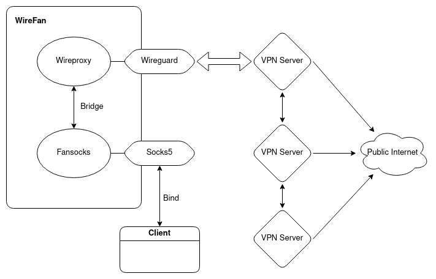

# wirefan
Combination of [wireproxy](https://github.com/octeep/wireproxy) and [fansocks](https://codeberg.org/peterzam/fansocks) forked/branched from wireproxy

This software only support SOCKS5 proxy. If you want to use HTTP proxy, convert SOCKS5 to HTTP with [socks2http](https://codeberg.org/peterzam/socks2http) 


# Why you might want this
- Want wireguard as a way to proxy some traffic
- Don't want root permissions or new virtual tun/tap adapter to use/test wireguard
- Rotate socks5 proxies within wireguard network (Mullvad, IVPN, ProtonvVPN and many support this type of Multi-hop proxy)

# Usage

## CLI
```
./wirefan 
  -bind string
        Bind address/Server listen address (also supports unix socket) (default "0.0.0.0:1080")
  -mode string
        Modes - wire(wire only), fan(fan only), socks(socks only), wirefan (default "wirefan")
  -pass string
        SOCKS5 Password
  -socks-conf string
        SOCKS5 servers list file (default "socks.conf")
  -user string
        SOCKS5 Username
  -wg-conf string
        Wireguard config file path (default "wg.conf")
```

## Docker 
```bash
# Clone wireproxy repo and cd into repo
git clone https://codeberg.org/peterzam/wirefan.git

cd wirefan

# Build Docker Image
docker build -t peterzam/wirefan .

# Run Docker Container
docker run -d -v <wireguard_config_file_path>:/wg.conf -v <socks address list>:/socks.csv -p 1080:1080 peterzam/wirefan --user=<username> --pass=<password> --wg-conf=/wg.conf --socks-conf=/socks.csv
```
# Example

## Wireguard config file
```
[Interface]
PrivateKey = xxxxxxxxxxxxxxxxxxxxxxxxxxxxxxxxxxxxxxxxxxxx
Address = xx.xx.xx.xx/xx
DNS = xx.xx.xx.xx

[Peer]
PublicKey = xxxxxxxxxxxxxxxxxxxxxxxxxxxxxxxxxxxxxxxxxxxx
AllowedIPs = 0.0.0.0/0
Endpoint = xx.xx.xx.xx:51820
```
## Socks CSV file
```
au1-wg.socks5.relays.mullvad.net:1080
au2-wg.socks5.relays.mullvad.net:1080
au3-wg.socks5.relays.mullvad.net:1080
au4-wg.socks5.relays.mullvad.net:1080
```
---
# Modes

## wirefan = wireproxy + fansocks

```./wirefan --wg-conf=<wireguard config> --socks-conf=<socks list csv>```  

***TL;DR:*** Connect the wireguard, rotate the multihop, can connect at `bind` address.  

First, wirefan connect the VPN server with wireguard, listen traffic with socks5 server at ***bridge***, fansocks client connect the bridge, rotate the connections, open a new socks5 server at ***bind*** where the client can access.

---

## wire = wireproxy + no fansocks  

```./wirefan --wg-conf=<wireguard config> --no-fan```
Just connect to wireguard. Same function as [wireproxy](https://github.com/octeep/wireproxy)

---
## fan = no wireproxy + fansocks

```./wirefan --socks-conf=<socks list csv> --no-wire```
Just randomize the socks connections. Same function as [fansocks](https://codeberg.org/peterzam/fansocks)

---
### socks = no wireproxy + no fansocks

```./wirefan --no-wire  --no-fan```
Plain socks5 server. Proxy from the running host.

---
# Diagram



# Note
Port forwarding function is dropped. If you want to use, check the origin repo at github.com/octeep/wireproxy.git
